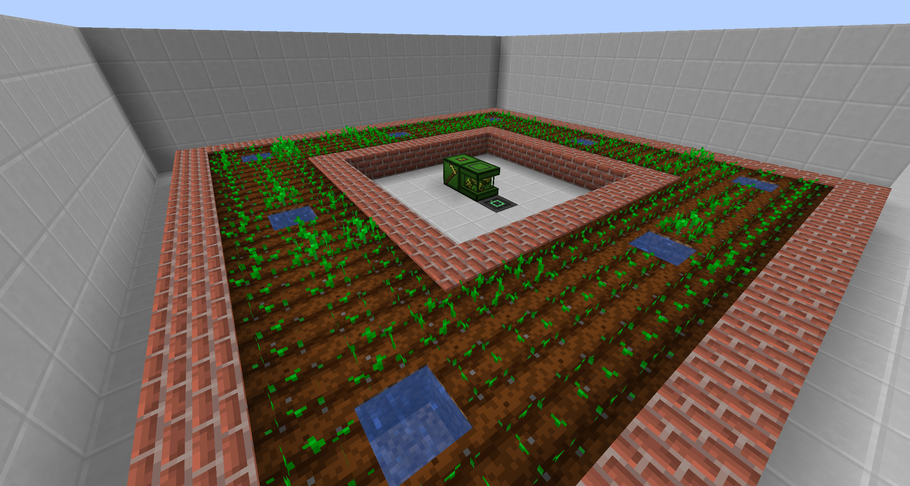
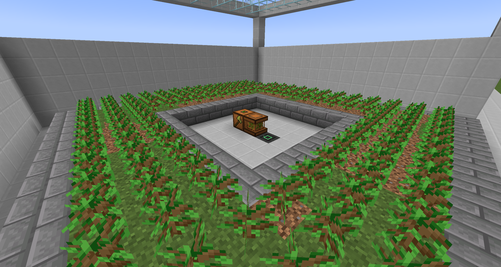
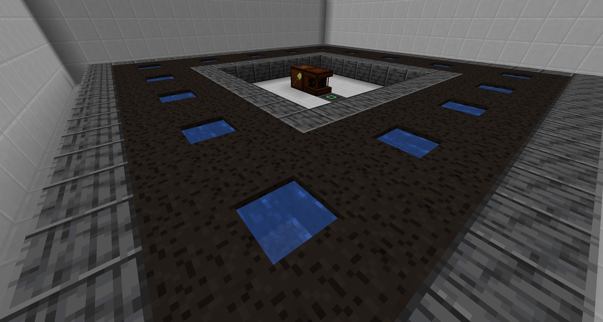
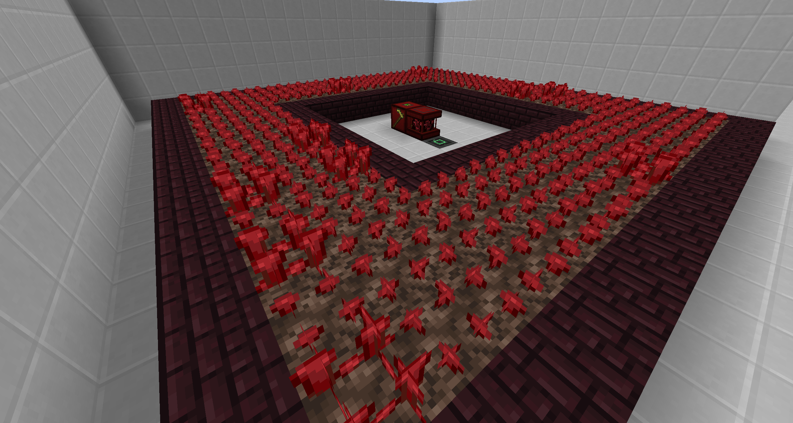
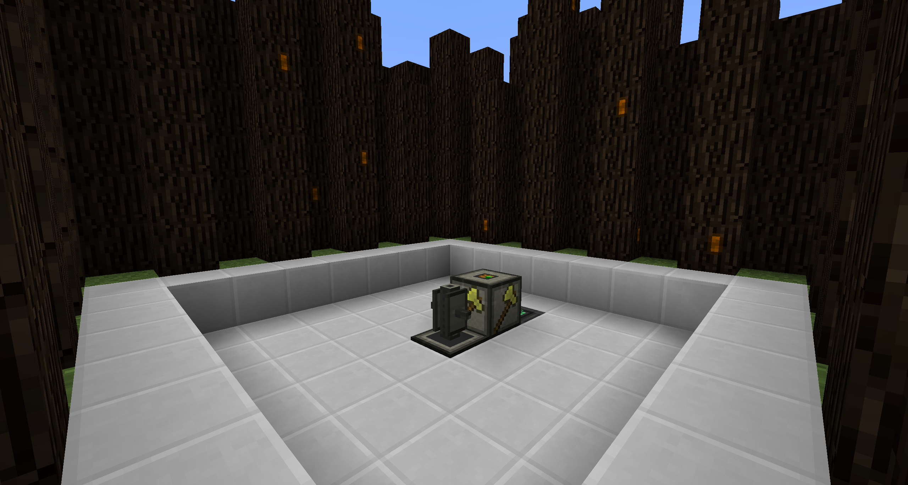
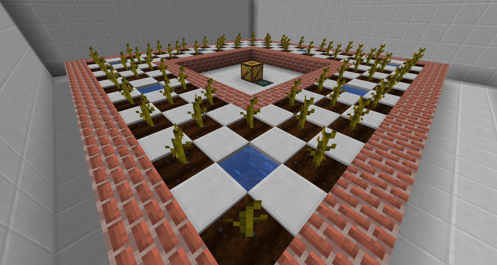
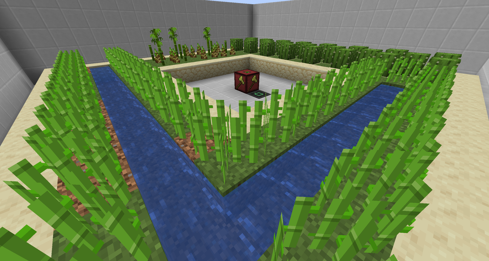
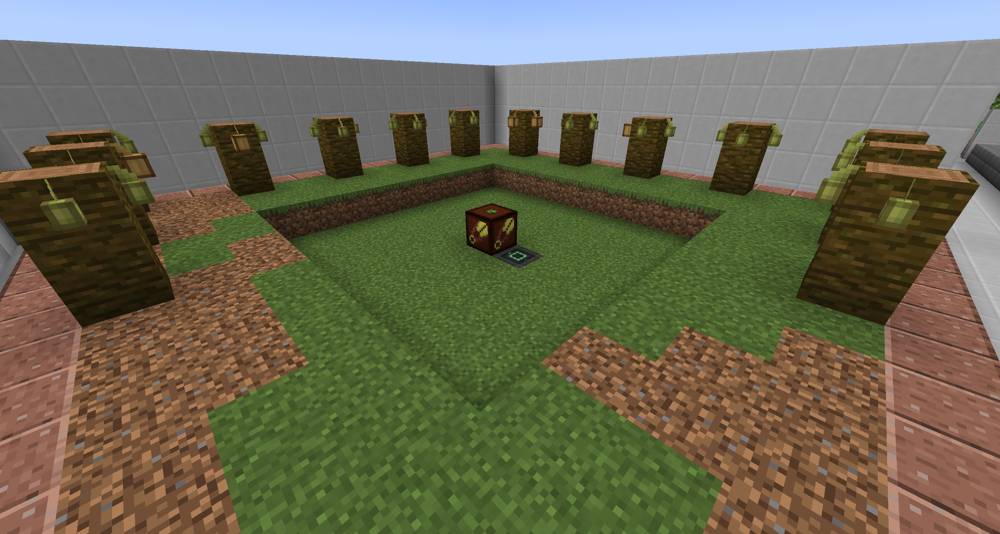

### Cross' Farming Mod for Minecraft 1.19.2 running on Forge

This mod provides a way to automate basic farming needs, such as farming crops, trees, cactus, bamboo, sugar cane, pumpkin, melon, cocoa beans and sticky resin from IC2Classic.

There are 2 types of farms:

 - Managed: automatically build the platform and collect crops/drops
 - Manual: only collects crops, the platform has to be built manually  

Each Managed farm consists of 2 blocks: Main Farm Block and Combine Block

Each Manual farm consists of Combine Block only

The Main Farm block can IO items via GUI, The Combine can ONLY output items using  Hopper or pipes.

### Items

 - Peat: can be obtained by harvesting the Peat Block. Has a burning time of 2000 ticks, meaning it can smelt 10 items.

### Blocks

#### Misc Blocks:

 - Bog Earth: once placed down, it checks for water around it. If there is water blocks, it will eventually transform into a Peat Block which can be harvested using shovel
 - Peat Block: the final form of Bog Earth, if harvested, it'll drop 2xDirt Blocks as waste and 1 Peat

#### Managed Farms:
  - Crops
    - Working Range: 15 blocks
    - Requires: Dirt/Farmland blocks & seeds/crops
    - Can farm: wheat, potato, carrot, beetroot

  - Trees
    - Working Range: 15 blocks
    - Collecting area: working area + 5 blocks
    - Requires: Dirt blocks & saplings
    - Can farm: wood, saplings, sticks, apples

  - Peat
    - Working Range: 15 blocks
    - Requires: Bog Earth Block 
    - Can farm: Peat, sand as waste

  - Nether Wart
    - Working Range: 15 blocks
    - Requires: Soul Sand & Nether Wart
    - Can farm: nether wart 

#### Manual Farms:
  - Resin Farm (IC2C compat)
    - Working Range: 15 blocks from Combine Block's Y + 1
    - Can farm: sticky resin from IC2Classic

  - Pumpkin, Melon Farm
    - Working Range: 15 blocks from Combine Block's Y + 1
    - Can farm: pumpkin, melon slice

  - Cactus, Bamboo, Sugar Cane Farm
    - Working Range: 15 blocks from Combine Block's Y + 2
    - Can farm: cactus, sugar cane, bamboo

  - Cocoa Beans Farm
    - Working Range: 15 blocks from Combine Block's Y + 2
    - Can farm: cocoa beans

